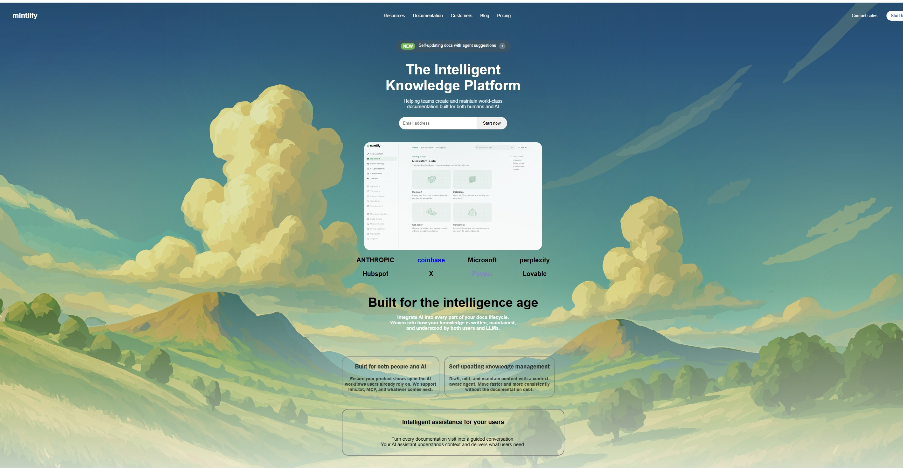
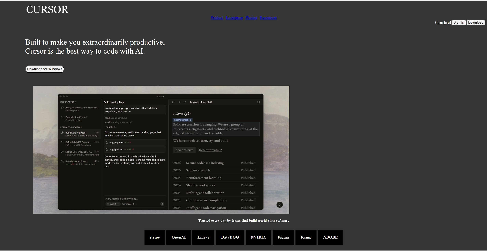

## Project Preview

# project_html_css
#Created a documentation platform-Mintify
*Created nav bar with different links inside it
*Created a hero section which includes some catchy sentences while asking for email address to start creating it.
*Created a class which shows the sponsorship brands and their contribution for the particular site.
*Mentioned about the offerings provided by this site
*At last footer is created which shows the company information.

#Created another web page 
*It is DEV TOOL landing page-CURSOR
*Use nav tag in the heading and created different sections which includes image tag with several buttons 
*Applied flex properties to adjust the content in css

